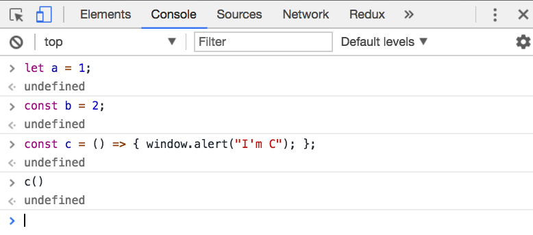

## ES6简介
>ES6(ECMAScript2015)是2015年6月发布的新一代Javascript语言标准
>
>1. ES6就是ECMAScript的第6版，因是2015发布的，所以也叫ECMAScript2015。
>2. ECMAScript是javascript的语言标准，而javascript是ECMAScript的实现。

## Babel转码器

> 因为现在的浏览器对ES6的新语法，并不是完全支持，所以需要将ES6的语法转码成ES5。

* 目前大多数比较常用的ES6新语法，chrome-60.0及以上版本都支持的较好，可以直接用来熟悉语法



* 实时查看es6转码: http://babeljs.io/repl/

* 在线使用es6语法编码

  * codepen在线编辑器：https://codepen.io/pen/?editors=1111
  * jsfiddle在线编辑器: https://jsfiddle.net/

* 项目中是怎样使用babel的？

  > 因babel实时编辑比较耗时，所以在实际项目中，都比较推荐本地编译好，再打包到生成环境。

  * babel-cli 命令行编译 [参考](http://babeljs.io/docs/usage/cli/)

    ```shell
    // install
    npm install --save-dev babel-cli
    // execute
    babel script.js --out-file script-compiled.js
    ```

  * babel-register 实时编译(不推荐) [参考](http://babeljs.io/docs/usage/babel-register/)

  * .babelrc 配置文件(常用) [参考](http://babeljs.io/docs/usage/babelrc/)

## let和const

[参考](http://es6.ruanyifeng.com/#docs/let)

#### 1. 块级作用域

```javascript
// es5, 只有函数作用域，没有块级作用域
function foo() {
    var a = 1;
}
foo();
console.log(a);

if(true) {
    var b = 1;
}
console.log(b);

for(var i = 0; i < 5; i++) {
    ...
}
console.log(i);
  
// es6, 用let及const声明的变量默认拥有块级作用域, 即只在let/const命令所在的代码块内有效
if(true) {
	let a = 1;
}
console.log(a);

for(let i = 0; i < 5; i++) {
    ...
}
console.log(i);
```

#### 2. 不能重复声明

```js
// es5, 可以重复声明
var a = 1;
var a = 2;
console.log(a);

// es6, 不可以重复声明
let a = 1;
let a = 2;
console.log(a);
```

#### 3. 不存在变量名提升

```js
// es5 变量名会提升
console.log(a);
var a = 1;

// es6 变量名不会提升
console.log(a);
let a = 1;
```

#### 4. 暂时性死区

```js
// es5
var a = 1;
function foo() {
	console.log(a);
  	
  	var a = 10;
}

// es6, 用let声明变量,会将变量绑定到当前块作用域, 不受外界影响
var a = 1;
function foo() {
    console.log(a);
  
	let a = 10;
}
```

#### 5.const的不同

> 除与let声明的变量都有以上特性外，用const声明的一定是一个只读的常量，他的值不能被更改。

1. const值不能被改变
2. const声明的变量必须初始化就赋值
3. const声明的变量不能变，实质指的是他的地址不能变

```js
const a = 1;
a = 2;
console.log(a);

const b = [1, 2, 3, 4];
b.push(5);
console.log(b);
```

#### 小结

1. 块级作用域，声明的变量只在let/const命令所在的代码块内有效。
2. 不能重复声明
3. 不存在变量名提升（了解）
4. 暂时性死区，即声明的变量将绑定到当前块作用域, 不受外界影响


## 变量解构赋值

>  解构就是从数组或对象中提取值，并赋给相应变量。

#### 1.基本用法

```js
// es5
var fullName = ['zhang', 'san'];
var lastName = fullName[0];
var firstName = fullName[1];
// es6解构赋值, 数组按位置解构
let [lastName, firstName] = fullName;

// 对象也一样解构，对象按key解构
var fullName = { first: 'san', last: 'zhang' };
let { first, last } = fullName;
```

#### 2.默认值

```js
let { first = 'dada' } = {};
console.log(first);
```

#### 3.函数解构赋值

```js
function foo(a) {
	let { first, last } = a;
    console.log(first, last);
};
// 你可以这样做
function foo({ first, last }) {
    console.log(first, last);
}
```

## 模板字符串

> 用反引号（`，在键盘1字键的左边）标识模板字符串

```js
// es5
var count = 10;
var html = '<div>' + count + '</div>';

// 模板字符串
const html = `<div>${count}</div>`;
```

## 函数

#### 1.函数默认值

```js
// es5, 默认值，使用逻辑操作符||实现
function foo(a) {
    const aa = a || 'dada';
  	console.log(aa); // dada
};

// es6
function foo(a = 'dada') {
    console.log(a); // dada
};
```

#### 2.箭头函数

```js
const foo = () => {
	return 'FOO';
};
// 等价于es5
const foo = function () {
    return 'FOO';
};
```

* 函数代码块只有一行，可省略return语句

  ```js
  // es6
  const foo = () => 'FOO';
  // 注意, 对象需要用()括起来
  const foo = () => ({a: 1, b: 2});
  ```

* 不能做构造函数，即不能用new调用

  ```js
  // es6
  const foo = () => 'FOO';
  const f = new foo(); // error
  ```

## 展开运算符

> 用三个点...表示扩展运算符

```js
// 将一个数组展开
const a = [1, 2, 3];
console.log(a); // [1, 2, 3]
console.log(...a); // 1 2 3

// 将一个对象展开, 其实这个是ES2017引入的，但比较常用
const b = { first: 'san', last: 'zhang' };
console.log(b); // {first: "san", last: "zhang"}
const c = { ...b };
console.log(c); // {first: "san", last: "zhang"}

```

#### 1.通常用来新建对象或数组

```js
const b = { first: 'san', last: 'zhang' };
const c1 = b;
const c2 = { ...b };

b === c1 // true
b === c2 // flase

const d = { first: 'si', ...b };
console.log(d); // { first: 'si', last: 'zhang' };
```

#### 2.合并对象

```js
const a = { aa: 1 };
const b = { bb: 2 };

// { aa: 1, bb: 2 }
const ab = { ...a, ...b };
```

#### 3.多说一句，对象简写

```js
// key和value一样的键值对，可以简写为key
const a = { aa: 1 };
const b = { bb: 2, a: a };
// 等价于
const b = { bb: 2, a };
```

## Class

```js
// es5，实现class功能
function Foo(x, y) {
    this.x = x;
  	this.y = y;
};

var f = new Foo(1, 2);
console.log(f.x, f.y); // 1 2

// es6, class用法
class Foo {
    constructor(x, y) {
        this.x = x;
      	this.y = y;
    }
};

const f = new Foo(1, 2);
console.log(f.x, f.y); // 1 2
```

#### 1.支持继承

```js
class Animal {
    constructor(name) {
        this.name = name;
    }
  
    // 实例方法
  	printName() {
        console.log(this.name);
    }
};

class Dog extends Animal {
    constructor(name) {
        // 调用父级方法
        super(name);
    }
};

const d = new Dog('corgi');
d.printName(); // corgi
```

#### 2.支持对象属性和静态属性及方法

```js
class Car {
    // 对象属性, react用的较多, 可以用babel-plugin-transform-class-properties
    state = {
        run: true,
    }

	// 静态属性, 也可说类属性
	static propTypes = {
        color: 'red',
    }

	// 静态方法
	static go() {
        console.log('go....');
    }
}

const c = new Car();
console.log(c.run); // true
console.log(Car.propTypes); // { color: 'red' }
console.log(Car.go()); // go....
```

## Module语法

#### 1.export导出多个变量 

```js
// main.js 导出一个变量
export const a = 1;
export const b = () => 20;
// 等价于
export {
  a,
  b,
}; 

// index.js中使用main.js中的变量
import { a, b } from './main.js';
// 可以不解构
import * as obj from './main.js';
console.log(obj.a, obj.b);
```

#### 2.export导出默认值

> 1. 同一个文件中允许同时存在export default 和 export 单个变量
> 2. 不能通过解构引用通过export default导出的模块中的变量
> 3. 一个文件中只能有一个export default
> 4. import时可以取任意名字

```js
// main.js导出一个默认变量, 可以同时存在export, export default
const obj = { a: 1, b: 2 };
export const dada = 100;
export default obj;

// 正确，index.js使用main.js中的变量
import obj from './main.js';
console.log(obj); // { a: 1, b: 2 }

// 错误，不能通过解构引用通过export default导出的模块中的变量
import { a } from './main.js'; // a = undefined

// 错误，main.js 中存在两个export default
export default { a: 1 };
export default { b: 2 };

// 正确，import时可以取任意名字
import myobj from './main.js';
console.log(myobj); // { a: 1, b: 2 }
```


>参考链接
1. [ECMAScript 6 入门](http://es6.ruanyifeng.com/)
2. [MDN](https://developer.mozilla.org/zh-CN/docs/Web/JavaScript/Reference)

