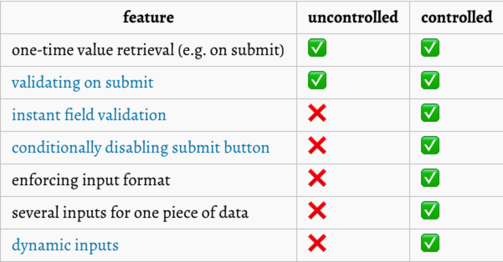
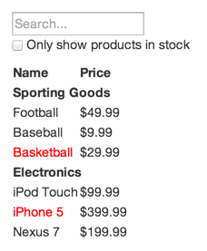

## JSX条件渲染及列表

#### 条件渲染

> [参考](https://facebook.github.io/react/docs/conditional-rendering.html)

```jsx
// if条件
const renderBtn = loading => {
  	if(loading) {
        return <LoadingButton />
    }
  
    return <Button />
}

// 逻辑操作符
render() {
  	return (
    	<div>
        	{ loading ? <LoadingButton /> : <Button /> }
      	</div>
    );
}
```

#### 列表渲染

> [参考](https://facebook.github.io/react/docs/lists-and-keys.html)

```jsx
// js
const numbers = [1, 2, 3, 4, 5];
const doubled = numbers.map(number => number * 2);
console.log(doubled);

// jsx
const numbers = [1, 2, 3, 4, 5];
const listItems = numbers.map(number =>
  <li>{number}</li>
);

// render
ReactDOM.render(
  <ul>{listItems}</ul>,
  document.getElementById('root')
);

// output
<ul>
	<li>1</li>
  	<li>2</li>
  	<li>3</li>
  	<li>4</li>
  	<li>5</li>
</ul>
```

##### key

> 列表渲染需为每一个子项提供特殊key属性，表明该子项是唯一的，便于react判断子项是否有变化。
>
> key的值应该是稳定的、相对兄弟节点唯一的。
>
> 参考: [为什么key是必要的](https://facebook.github.io/react/docs/reconciliation.html#recursing-on-children)

```jsx
const numbers = [1, 2, 3, 4, 5];
const listItems = numbers.map((number) =>
  <li key={number.toString()}>
    {number}
  </li>
);
                              
// 用属性id值作Key
const todoItems = todos.map((todo) =>
  <li key={todo.id}>
    {todo.text}
  </li>
);

// 如果该列表不会排序的话，可用index作key
const todoItems = todos.map((todo, index) =>
  // Only do this if items have no stable IDs
  <li key={index}>
    {todo.text}
  </li>
);
```

#### 受控组件与非受控组件

> 受控组件: form表单的数据交由react处理。可以与其他组件共用表单数据以及将数据交由store统一状态管理。
>
> 非受控组件: form表单的数据交由dom自己处理。传统的操作真实dom获取数据，类似jQuery
>
> 大多数情况下，推荐使用非受控组件

比较:



```jsx
受控组件: LearnReact/lesson-3/lesson/src/form/controlled.js
多个受控组件: LearnReact/lesson-3/lesson/src/form/multiControlled.js
非受控组件: LearnReact/lesson-3/lesson/src/form/uncontrolled.js
```

#### 状态提升

> 很多时候，你需要多个组件共用同一个数据, 这个时候，推荐将这个数据(state)提升到一个公共的祖先组件中。

```jsx
代码: LearnReact/lesson-3/lesson/src/LiftStateUp
```

#### React理念

> 1. 组件遵守单一职责原则: 一个组件只做一件事
> 2. 单向数据流
>
> [参考](https://facebook.github.io/react/docs/thinking-in-react.html)

一个可搜索的table组件示例



1. 划分组件层级
2. 构建静态版本
3. 确定哪些是state数据
4. 确定你的state应该放在哪个组件中
5. 增加反向数据流
