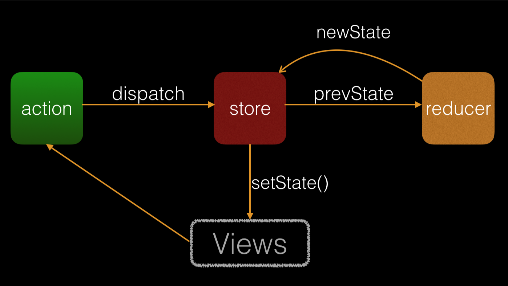

### prop-types

> 运行时参数检验
>
> 1. 在react主要是在开发环境下对props参数类型进行校验.

```jsx
import PropTypes from 'prop-types';

class SearchBar extends Component {
  static propTypes = {
    keyword: PropTypes.string,
    filterStock: PropTypes.bool,
    onChange: PropTypes.func,
  }
}
```

### Redux

> Redux 是 JavaScript 状态容器，提供可预测化的状态管理。
>
> react项目中多个组件共用state时，需要将该state上升到公共的祖先组件中([参考](https://facebook.github.io/react/docs/lifting-state-up.html)), 子组件中的状态变更通过回调上传到祖先组件中统一维护。当项目错综复杂，组件层级较多时，会出现多级回调，组件state难以维护。这个时候就可以用上状态管理库，如redux
>
> 注：你是否使用redux，简单的判断依据是某个组件的状态，你是否需要共享。
>
> [参考](https://github.com/reactjs/redux)

来个图：



views: 视图

action: 描述发生了什么的对象

reducer: 描述具体是怎样发生改变的

store: 单一数据源