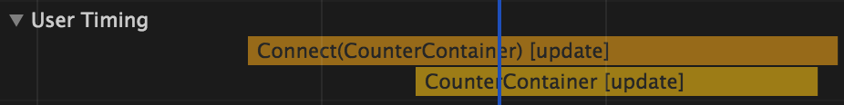
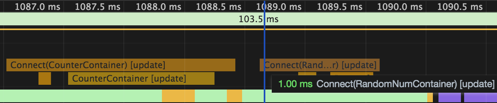

# React性能优化初探
## 不要将当前container没有用到的state绑定到props

```jsx
// src/example1/containers/CounterContainer.js
export default connect(state => ({
  total: state.example1.total,
}), { increment })(CounterContainer);

// src/example1/containers/RandomNumContainer.js
export default connect(state => ({
  randomNum: state.example1.randomNum,
}), { setRandomNum })(RandomNumContainer);
```

### 当组件`CounterContainer`中total改变时，不会引起RandomNumContainer组件render



如果在`RandomNumCountainer`中加入没有用到的total变量时

```jsx
// src/example1/containers/RandomNumContainer.js
export default connect(state => ({
  randomNum: state.example1.randomNum,
  total: state.example1.total,
}), { setRandomNum })(RandomNumContainer);
```

组件`CounterContainer`中total改变时，会引起RandomNumContainer组件render



#### 需要多次使用state计算得到的数据，请使用reselect缓存

```jsx
// src/example2/containers/CounterContainer.js
// 主要函数
...
  get formatTotal() {
    const { total } = this.props;

    console.log('call formatTotal()');
    // 复杂的计算
    return total * 10;
  }

  render() {
    const { total, clickTime } = this.props;

    return (
      <div>
        <span>CounterContainer: { total }</span>
        <button onClick={this.handleClick}>+</button>

        <div>格式化后的total: { this.formatTotal }</div>
        <div>格式化后的total2: { this.formatTotal }</div>

        <button onClick={this.handleTimeClick}>获取点击时间: { clickTime }</button>
      </div>
    );
  }
...

1. 点击+号后，会调用两次formatTotal
call formatTotal()
call formatTotal()
2. 点击获取点击时间，会调用两次formatTotal
call formatTotal()
call formatTotal()

如果，formatTotal是一个复杂计算的函数，性能是堪忧的。
```

使用selector优化后的版本

```jsx
// 将formatTotal传递到组件的props中

const getTotal = state => state.example2.total;
const formatTotal = createSelector(
  [getTotal],
  (total) => {
    console.log('call formatTotal()');

    return total + 10;
  },
);

export default connect(state => ({
  total: state.example2.total,
  clickTime: state.example2.clickTime,
  formatTotal: formatTotal(state),
}), { increment, setClickTime })(CounterOptimizeContainer);
```

注意：

1. 不要将当前container没有用到的state绑定到props
2. 需要多次使用state计算得到的数据，请使用reselect缓存
3. 使用PureComponent替代Component，避免不必要的render
4. 尽量将大组件进行拆分，避免兄弟组件的state改变，引起自身重复render
5. 避免不必要的props更新。
   1. 避免在render函数中使用`this.handleClick.bind(this)`以及`(id) => this.handleClick(id)`，如需绑定this，请在constructor中绑定`this.handleClick = this.handleClick.bind(this)`, 如需绑定特定属性值，可以将该组件封装成子组件`<ChildComponent data={item} onClick={this.handleClick} />`,在子组件中处理回调。
   2. <Component list={data || []} />
   3. 请慎用{…this.props}，尽量只传递子组件需要的props
6. 子组件使用shouldComponentUpdate时，如果父组件直接修改state值，会因为引用赋值的缘故，继而导致子组件中props值一起改变，这时，即使父组件调用setState更新了子组件的props, 子组件中shouldComponentUpdate也会判断失败，导致子组件更新失败。

Q:
1. store中为什么要使用immutable数据
